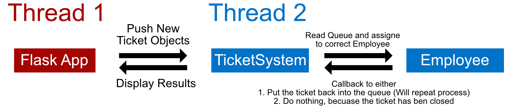

# #1 Code Challenge To App - Chain of responsibility - Python

<b>In my series Code Challenge, I am tackling code challenges and try to transform them into a s real world issue. With that Approach I can then build a small Application to illustrate the problem better.</b>

## The Challenge

A support (or any other customer relationship) department usually has multiple levels of expertise or responsibility. This is the perfect place to illustrate the Chain of Responsibility pattern. I took this code challenge from a recent interview I had.

> Imagine you have a sales department with three levels of employees: backoffice, account manager, and director. Whenever a case is automatically created, it must be first allocated to a backoffice employee who is free. If the backoffice employee can't handle the case, he or she must escalate the case to an account manager. If the manager is not free or not able to handle it, then the case should be escalated to a director.

## Theory of Chain of Responsibility

I think there are many better ways to explain the Chain of Responsibility pattern than I can do. However, I will give a very brief overview of wht it actually is.

Definition: ([source](https://refactoring.guru/design-patterns/chain-of-responsibility))

> The Chain of Responsibility pattern is a behavioral design pattern that allows you to pass requests along a chain of handlers. Upon receiving a request, each handler decides either to process the request or to pass it to the next handler in the chain.

In our particular case the chain of responsibility is the following:

1. Backoffice
2. Account Manager
3. Director

Every employee can decide for them selfs if they can handle the case or not. If they can't handle it, they pass it to the next employee in the chain. If they can handle it, they do so and the chain is broken.

## End Product

(IMAGE)

I created a minimal Flask app which accepts cases and then on a second thread I have running a self written queue system. So nothing production ready, but it illustrates the problem. I will try to wal k you through the app in the following sections.

## The Code

### Introduction

I think it is always helpful to understand the entry point of an application hence I am not starting to explain the core logic first.

Inside [app.py](LINK) wa have the entry point of the application in which we create the Flask app, register the routes and start the second thread on which the TicketSystem Class is running.

Here is the app schematically represented:



### Core Logic

The heart of the application is the [TicketSystem Class](). It is a class which is running on a second thread and is responsible for handling the tickets. And in combination with the [employee classes]() it illustrated the Chain of Responsibility pattern.

Let us First look at the TicketSystem:

```python
class TicketSystem:
    # Constructor
    def __init__(self, back_office_employees: Set[Employee], account_managers: Set[Employee], directors: Set[Employee]):
        self.tickets = []
        self.history = []
        self.back_office_employees = back_office_employees
        self.account_managers = account_managers
        self.directors = directors
        print(self.back_office_employees)

    # Core Logic
    def work(self):
        """
        This method is running on a second thread and is responsible for handling the tickets.
        """
        try:
            while True:
                if len(self.tickets) > 0:
                    ticket = self.tickets.pop(0)
                    self.assign_case(ticket)
        except KeyboardInterrupt:
            print("Keyboard interrupt")
            exit(0)

    def dispatch_case(self, ticket: Ticket):
        """
        This method is called by the Flask app and adds the ticket to the queue.
        """
        self.tickets.append(ticket)
        self.history.append(ticket)

    def assign_case(self, ticket: Ticket):
        """
        This method is responsible for assigning the ticket to the right employee. Called by the work method on the second thread.
        """
        employee = self.get_employee(ticket)
        if employee is None:
            return
        employee.assign_case(ticket, callback=self.handle_employee_response)

    def handle_employee_response(self, status: bool, employee, ticket: Ticket):
        """
        Employee callback to inform the TicketSystem about the status of the ticket and whether it needs to be put back into the queue.
        """
        print("Ticket", ticket.title, "was handled by", employee.name, "with status", status)
        if not status:
            self.tickets.append(ticket)

    def get_employee(self, ticket: Ticket):
        if ticket.difficulty == 1:
            return self.get_free_back_office_employee()
        elif ticket.difficulty in (1, 2):
            return self.get_free_account_manager_or_director()
        elif ticket.difficulty in (1, 2, 3):
            return self.get_free_director()

    # Start of Helpers
    def get_free_back_office_employee(self):
        for employee in self.back_office_employees:
            if employee.is_free:
                return employee
        return None

    def get_free_account_manager_or_director(self):
        for employee in self.account_managers:
            if employee.is_free:
                return employee
        for employee in self.directors:
            if employee.is_free:
                return employee
        return None

    def get_free_director(self):
        for employee in self.directors:
            if employee.is_free:
                return employee
        return None
```

So what is happening here? The Flask End point calls the `dispatch_case` method which adds the ticket to the queue (`self.tickets`). The `work` method is running on a second thread and is responsible for handling the tickets. It calls the `assign_case` method which uses the helper `get_employee`. This method is responsible for finding the right employee for the ticket. So here we can see our chain. If the `difficulty` of the ticket is 1, we are looking for a free back office employee. If the `difficulty` is 2 or 3, we are looking for a free account manager or director. If the `difficulty` is 3, we are looking for a free director.

The `difficulty` is set directly on the [Ticket](LINK) class and can be raised by the employee. Below you can see the call to the `assign_case` method of the employee. So we give the employee the ticket and a callback function which.

```python
    def assign_case(self, ticket: Ticket, callback):
        """
        This method is called by the TicketSystem and set the employee instance up to be blocked and starts the work on the ticket.
        """
        self.is_free = False
        result = self.handle_ticket(ticket)
        callback(result, self, ticket)

    def handle_ticket(self, ticket: Ticket):
        """
        Here we can see the simulated work of an employee on a ticket.
        (In a real system this would be an employee working on a ticket and either closing it or escalating it)
        """
        ticket.start(self)
        if not self.can_handle_task(ticket.difficulty):
            self.is_free = True
            return False
        sleep(self.calculate_sleep_time(ticket))
        ## I will later speak how I simulated the escalation
        if self.can_handle_task(ticket.target_difficulty):
            ticket.close(self)
            self.is_free = True
            return True
        else:
            ticket.escalate()
            self.is_free = True
            return False
```

As we can see the employee either raises the difficulty of the ticket or closes it. If the ticket was closed we return `True` and the ticket stays removed from queue. If the ticket was escalated we return `False` and the ticket is put back into the queue, inside the callback function `TicketSystem.handle_employee_response`.

To simulate the required level of expertise on a ticket I simply have two difficulties set on a ticket. The `target_difficulty` is the required level of expertise and the `difficulty` is the current level of expertise. If the employee escalates the ticket, then the `difficulty` is raised by one. This will happening till the `difficulty` is equal to the `target_difficulty` and an employee can handle the ticket.

[Ticket](LINK) class:

```python
class Ticket:
    def __init__(self, title: str, description: str, target_difficulty: int = 1):
        if target_difficulty < 1 or target_difficulty > 3:
            raise ValueError('Difficulty must be between 1 and 3')
        self.id = uuid4()
        self.title = title
        self.description = description
        self.difficulty = 1 # 1 = easy, 2 = medium, 3 = hard
        self.target_difficulty = target_difficulty # back office employee difficulty target
        self.status = TicketStatus.OPEN
        self.history = []
        self.current_employee = None
        self.start_time = None
        self.end_time = None

```
