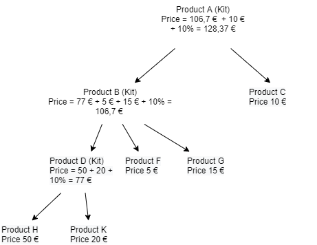

# Product Tree

## Intro

Company A has a catalog with products that can be composed of other products. Products that are composed by other products are called kits. The components of a kit can be either single products, or other kits which are in turn composed of other products/kits. Each product/kit has a Price and ID. The price of a kit is calculated as the sum of prices for all its products + 10%. The prices of single products are fixed.

An example product tree would be as follows:

## Your Task

Please create an app with the following features:

1. Users can create a product tree either by manually creating each component or by deserializing a JSON/XML or other data format
2. Users can display each component in the tree and their data. Indentation must be used to indicate child components/products
3. Prices are calculated automatically for kits – both the root kit, and other kits in the product tree
4. When the tree is created, it is validated to make sure that there are no circular references. For example, structures like Kit A => Kit B => Kit C => Kit A should be avoided because they can lead to infinite recursions.

## Remarks

1. Preferred is to use C# and .NET, but Python, Java, or Javascript are also acceptable
2. The app can be either a console app or a web app, whichever you prefer.
